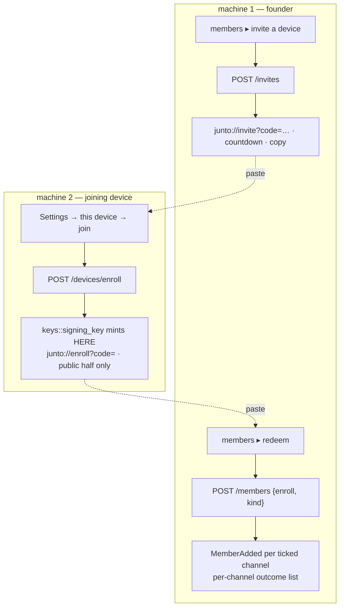

# Device pairing in the surface — design

**Date:** 2026-08-21
**Status:** approved in brainstorming (Dan, 2026-08-21); spec for review
**Provenance:** the device-key-enrollment work ([design](2026-08-21-device-key-enrollment-design.md), [plan](../plans/2026-08-21-device-key-enrollment.md), [ADR 0035](../../adr/0035-membership-is-set-based-except-after-revocation.md), PRs [#65](https://github.com/dcieslak19973/junto/pull/65) / [#66](https://github.com/dcieslak19973/junto/pull/66) / [#67](https://github.com/dcieslak19973/junto/pull/67)) shipped the mechanism with `junto keys list` as its only read surface and no write surface at all — its own non-goal list says "device naming or a management UI beyond `junto keys list` … is a later product question". This is that question, answered for the case Dan named: **his own second machine**, two junto installs he controls.

## Summary

Pairing a second machine becomes a flow in the **native surface** (the primary human surface, ratified `031f26a2`) instead of three terminal invocations across two machines. One pass through the flow grants the device **every channel the founder ticks**, not one channel per pass. The codes still travel by paste — the human's out-of-band confirmation is the trust anchor by design ([enrollment design](2026-08-21-device-key-enrollment-design.md), non-goals) — but everything either side of the paste is a screen.

Nothing about the record changes: no new entry kinds, no kernel change, no change to what a grant is or who may author one. The invite **envelope** goes to v2 so one invite can name many channels, and the host gains the endpoints the surface needs. Signing authority stays per-channel, exactly as [ADR 0017](../../adr/0017-party-is-a-projection-membership-is-founder-granted.md)/[0035](../../adr/0035-membership-is-set-based-except-after-revocation.md) define it; only the ceremony collapses.

## Why this exists

Three facts, each verifiable in the tree today:

1. **Identity is CLI-only.** The device-key work added six commands — `invite`, `enroll`, `add-member --enroll`, `keys list`, `revoke-member`, `retire-device` (`crates/junto/src/main.rs`). The host's router (`crates/junto/src/web.rs:43-90`) has no identity route of any kind: no roster, no keyring, no invite, no enrollment, no revocation. `ChannelView::keyring` is projected and read by exactly two consumers — the CLI and the live websocket handshake. There is no `/keys.json`, so the native surface **cannot** show a device even if it wanted to. [ADR 0018](../../adr/0018-human-surface-is-a-desktop-shell-over-the-host.md) set the direction that "the last human CLI touchpoint dies"; this wave moved the opposite way.
2. **The one identity fact that is visible is visible only on the surface Dan does not use.** `unrecognized` and `unverified` badges render on web entry cards (`crates/junto/src/render.rs:2790-2805`). `EntryDto` (`web.rs:1959`) carries `unrecognized` but not `unverified`, and the native timeline renders neither. So a revoked member's post-cutoff entries look completely normal in the native surface — the ADR 0035 cutoff is real in projection and invisible in the product.
3. **The ceremony multiplies by channel.** `keys::signing_key` is keyed by `(junto-home, email)` and mints "per identity per machine, reused across channels" (`crates/junto/src/keys.rs:52-53`) — one keypair per machine. But the keyring is a *channel* projection and `InvitePayload.channel` is a single canonical id (`crates/junto/src/enroll.rs:78-84`), so publishing that one key into N channels is N full exchanges, each with its own 600-second fuse. The machine registry currently holds 14 channels.

The failure mode is the worst kind: silent until remote. You learn nobody is enrolled when a live-session watcher will not connect — and the good three-way diagnosis ADR 0035 added (`NotAMember` / `Unenrolled` / `Revoked`) is text printed into a websocket rejection nobody reads.

## Decisions

| # | Decision | Rejected alternatives |
|---|---|---|
| 1 | **One pass grants many channels**, chosen by the founder | one channel per pass (the 14× ceremony survives, just prettier, and each pass burns its own 600s invite); device-level trust valid everywhere (needs a cross-channel identity concept junto does not have — grants are entries in a channel's own ledger — and would let one stolen device write into channels the founder never considered) |
| 2 | **Codes travel by paste**, on both ends | `junto://` OS deep link (halves the steps and is how a teammate will do it, but scheme registration is installer work and there is no distribution story — parked `779ad00e` — so it cannot be finished now); host-to-host enrollment over the network (fewest steps, but the founder's host would accept a write from an unauthenticated remote peer, which is the exact trust bootstrap the invite token exists to solve, and it breaks [ADR 0012](../../adr/0012-mcp-over-http-is-the-first-write-surface.md)'s localhost posture) |
| 3 | **The channel set never travels in a code.** The founder's own `invites.toml` already holds one record per `(token_sha256, channel)`, so redemption recovers the set locally by token hash | echoing `channels` back in the enroll payload (works, but puts the founder's channel names into a code that crosses machines, and makes the founder trust a list the far side could alter) |
| 4 | **The joiner's key is minted by the joiner's host**, over a new endpoint | minting in the native app (`junto-iced` is its own workspace that never links the `junto` crate and says so where it reads keys: "Never mints one: minting is the host's job" — `crates/junto-iced/src/main.rs:4156`); shipping a second key-store implementation into the GUI (two writers to `keys.toml`, one of them a GUI, for a file whose whole point is that secrets stay put) |
| 5 | **Redemption reports per-channel outcomes** and burns only what it appended | all-or-nothing (impossible to honour: appends are per-channel writes across possibly-different substrates, so there is no transaction to roll back); first-failure-aborts (leaves the operator guessing which channels landed) |
| 6 | **Envelope v2 replaces v1 outright**, with an actionable refusal for a v1 code | accepting both (a shim for a window that cannot exist: the TTL is 600 seconds, so no v1 code survives a release) |
| 7 | Identity acts from the surface authorize as **`WriteAuth::Human`** — membership + founder check, no member code | asking a human for a member code ([ADR 0021](../../adr/0021-member-codes-guard-agent-surfaces-only.md) settled this: codes guard agent surfaces only, and `diverge_channel` at `web.rs:1298-1312` is the pattern) |

## The seam: five host endpoints

Each follows the existing human-write pattern in `web.rs` — resolve the channel, derive the author from `host::git_user(&substrate)`, pass `WriteAuth::Human`, `spawn_channel_sync` after a successful append, route refusals through the styled error path.

| endpoint | runs on | authorization | returns |
|---|---|---|---|
| `POST /invites` `{member, channels[]}` | founder machine | founder of **every** named channel, checked before a token is minted | `{url, expires_at}` |
| `POST /devices/enroll` `{invite, name?}` | **joiner machine** | the invite token itself; localhost-only, no member code, no founder check | `{url, email, fingerprint}` |
| `POST /members` `{enroll, kind}` | founder machine | founder per channel, plus `invites::consume` per channel | `{outcomes: [{channel, result}]}` |
| `GET /channels/{c}/keys.json` | either | read | roster + grants |
| `POST /channels/{c}/keys/{grant}/retire`, `POST /channels/{c}/members/{email}/revoke` `{rationale}` | founder machine | founder; `rationale` required, no default | redirect / error |

Notes that are load-bearing, not incidental:

- **`/invites` and `/members` are not nested under a channel.** A v2 invite spans channels; nesting would lie about that. `GET /channels/{c}/keys.json` *is* nested, because a keyring genuinely is one channel's projection.
- **`/devices/enroll` is the only endpoint that mints a secret**, and it mints only for the email **the decoded invite carries**. It MUST NOT accept an email, display-name override notwithstanding — the enrollment design's rule that the email is "carried from the invite (NOT re-typed by the user)" is what stops an invite for one identity from enrolling another. Its response carries the public fingerprint so the joiner can read it aloud to confirm against what the founder sees.
- **`keys.json` publishes fingerprints only** — the 16 hex chars after the `ed25519:` prefix, the same `fingerprint` helper the CLI uses (`main.rs`, pinned by `fingerprint_is_the_16_hex_chars_after_the_prefix_not_the_prefix_itself`) — never a whole public key, matching the reason ADR 0035 gave for the CLI.
- **Founder checks reuse `require_founder`** (`main.rs:814`), lifted to a shared home so the CLI and the endpoints cannot drift on who may grant.



## Envelope v2

`PAYLOAD_VERSION` goes to `2` (`crates/junto/src/enroll.rs`), so both decoders reject v1 with a message naming the fix ("this invite came from an older junto — mint a new one"). Only the invite payload's shape changes:

```rust
pub struct InvitePayload {
    pub v: u8,                     // 2
    pub invite_token: String,
    pub member_email: String,
    pub channels: Vec<String>,     // canonical ids, resolved before minting
    pub expires_at: i64,
}
```

`EnrollPayload` is unchanged in shape (decision 3): token, email, display name, public key, expiry. The channel set stays on the founder's machine.

New bounds, in the order the existing decoder applies them: the total `MAX_CODE_CHARS` cap (132 096) is still checked **before** any parse; each element of `channels` is bounded by `MAX_FIELD_CHARS` (4 096); and `channels` itself is capped at **32 entries** and must be non-empty, so a malformed or hostile code cannot make redemption fan out unboundedly. TTL and skew are untouched (600 000 ms / 30 000 ms).

Store side, mirroring what `invites.rs` already does:

- `issue` is called **once per channel** with the same token, writing one `InviteRecord` per `(token_sha256, channel)`. `consume` therefore keeps its exact-id compare and its single-use-per-channel behaviour completely untouched — including `WrongChannel`, which now genuinely means "that channel was not on this invite".
- New: `pub fn channels_for(junto_home: &Path, token: &str) -> Result<Vec<String>>` — the unconsumed, unexpired channels an invite still covers, by token hash. This is what makes decision 3 work: the redeem screen shows the founder what they are about to grant without the far side telling it.

## Redemption is per-channel, and says so

`POST /members` walks the recovered channel set and, for each channel independently: checks the caller is that channel's founder, `consume`s the token for that channel, appends the `MemberAdded` carrying the payload's public key and the founder-declared `kind`, and syncs. It collects one outcome per channel:

| outcome | meaning |
|---|---|
| `granted` | appended; the device now has an active grant here |
| `already_a_member` | the roster already holds this email; `Host::add_member`'s existing no-op guard, reported rather than hidden |
| `invite_already_used` | `Consumed::AlreadyUsed` for this channel — a retry after a partial success lands here |
| `not_founder` | the caller does not found this channel; nothing was consumed |
| `failed(reason)` | anything else, verbatim |

Tokens are burned only for channels that actually appended, so re-pasting the same enroll code retries exactly the unburned remainder — the property that makes a partial failure recoverable without minting a fresh invite. `kind` is asked for once and applied to every channel; ADR 0035 forbids defaulting it, and the founder's judgment about who is behind a device does not vary by channel.

## The surface

Native Iced, the ratified primary surface. No new tab — each piece goes where its scope already lives.

**Settings → "this device"** (machine scope). The git identity this install writes as, whether `keys.toml` holds a key for it, and that key's fingerprint. Below it, **join a channel**: paste an invite, get back the enroll code with a copy button, the fingerprint to read aloud, and one plain line — *your secret key never leaves this machine*. Settings already renders read-only identity (`27f3fa1a`), so this extends a home rather than inventing one.

**Channel pane → "members"** (channel scope), replacing today's bare `party: a, b, c` text row (`crates/junto-iced/src/main.rs:2574-2585`). A disclosure listing one row per member — display name, kind badge, device count — expanding into device rows: fingerprint, granting entry id, and `retired` with its timestamp when set. Founder-only acts per row, using the same inline-form-with-confirm-and-rationale pattern the lifecycle acts already use (`ccf4dbc9`): **retire device** on a grant row, **revoke member** on a member row. Revoke carries the warning ADR 0035's CLI prints — the member stays in the party; only their entries after now stop counting.

**"invite a device"**, in that disclosure. Member email, then channel checkboxes: the current channel pre-ticked, the list being the channels this caller founds. Then the code, a copy button, and a **live countdown** to expiry — a 600-second fuse the user cannot see is a trap, and the countdown is the difference between "paste it now" and "why did this stop working".

**"redeem"**, beside it. Paste the enroll code; before anything is appended, see what it will grant: email, fingerprint, the channel set recovered from `invites.toml`, and an explicit `kind` picker with no default. Confirm, then the per-channel outcome list stays on screen until dismissed.

**Timeline badges.** `EntryDto` gains `unverified: bool` beside its existing `unrecognized`, and the native entry card renders both, reusing the web's wording and colour semantics (`render.rs:2790-2805`: red for unrecognized, yellow for unverified, and unverified suppressed on an unrecognized card because that badge already signals distrust louder). Without this the first four pieces ship a control panel for a mechanism nobody can observe.

## CLI cutover

The CLI stays — agents and scripts need it, and ADR 0021 keeps the code-guarded agent path distinct — but both surfaces speak one protocol. No shims, no aliases, no deprecated flags:

- `junto invite --member <email> --channel <c> [--channel <c2> …]` — `--channel` becomes repeatable, each resolved to a canonical id before the token is minted, `issue` called once per channel.
- `junto add-member --enroll <url> --kind <k>` — `--channel` is **removed** from this path: the channel set now comes from `channels_for`, which is strictly better than a human retyping one name (the hazard `add_member_enroll_resolves_channel_by_name_before_consuming_the_invite` exists to guard). It prints the same per-channel outcome list the endpoint returns.
- `junto keys list`, `revoke-member`, `retire-device` are unchanged in shape; their founder guards move to the shared helper the endpoints also call.

## Consequences

- **Party membership and signing authority diverge further, and now visibly.** The members panel shows a person with zero active grants as exactly that — admitted, unable to write. That is the honest reading of ADR 0035 and it will look odd the first time; the panel should read "no active devices" rather than implying removal.
- **A device enrolled into many channels retires per channel.** Retirement parks a grant in one channel's ledger, so a lost laptop is N retirements — or N `revoke-member` acts, one per channel. This design does not fix that (decision 1's rejected third option is what would), and the panel makes the shape of the work visible rather than pretending otherwise. Worth revisiting once it hurts.
- **`/devices/enroll` makes a localhost POST mint a key.** That is the same trust posture as the CLI's `junto enroll` (anyone at the keyboard can already run it) and no wider, but it is the first *endpoint* that writes secret material, so it must never appear in any surface reachable from the mobile/remote read-only web role.
- **Enrolling retroactively verifies that device's past entries** — carried forward from the enrollment design, and now something a UI causes with one click, so the redeem confirmation names it.
- **The web surface stays behind on identity, deliberately.** It keeps its read-only mobile/remote job (`031f26a2`); `keys.json` is readable there, but no identity write lands in the web pages in this slice.
- **An ADR is owed.** The envelope going multi-channel and the surface becoming an authorization site are decisions [0035](../../adr/0035-membership-is-set-based-except-after-revocation.md) does not cover; they need their own record (next free number, 0036) written with the implementation, citing this spec.
- **This slice is on the critical path for federation, and its N-per-channel shape will be stressed.** Recorded after a steer from the parallel *Multiplayer-first rethink 20260821* channel (`3c38ead9-4907-4646-99b7-23b21933da35`, diverged from `junto-dev`), whose three provisional decisions of 2026-08-21 are: topology is **federation** (every member keeps their own per-machine host; live sessions become peer-shareable, no shared gateway), the **channel/thread primitive collapses** (a thread *is* a channel, no required home repo), and **subjects become plural, typed and pluggable** (0..N per thread, a git repo being one kind beside a chat channel, a document, an issue). Two consequences for this design, neither of which reopens it:
  - **Federation needs exactly three things from this slice**: `POST /devices/enroll` (a member's own machine mints its own key), `GET /channels/{c}/keys.json` (a host can see which devices may sign), and the `unverified`/`unrecognized` badges (a federated peer's entries are legible as trusted or not). Today a remote watcher hand-copies `keys.toml` (`crates/junto/src/keys.rs`); that is the hole this closes. If scope is ever cut here, cut device-management polish — never those three.
  - **The 32-channel cap and the per-channel retirement loop are sized for today's 14 channels, not for collapsed threads.** Under the collapse, threads get cheap and N goes to hundreds, at which point "grant this device across all my channels" or an actual device-level grant becomes necessary — the very thing decision 1 rejected for good reasons that a hundredfold change in N may overturn. So the shape here is deliberately layerable: `channels_for` answers "which channels does this token still cover" (a set, not a scalar), and redemption is a **walk over that set producing one outcome per channel**. A future device-level or grant-all path replaces the *source of the set* and reuses the walk, without a third envelope version. Do not optimise the walk into something that assumes a small set.

## Non-goals

- **`junto://` deep links and OS scheme registration.** Decision 2's runner-up, deferred until there is a distribution story to register a handler from (parked `779ad00e`).
- **QR codes.** Both machines are keyboards, not cameras; the paste path already works and a QR here would be decoration.
- **Device naming.** A fingerprint plus a granting entry id identifies a device unambiguously; a friendly name is a nice-to-have that would need a place in the record to live, which is a separate decision.
- **Cross-channel or cross-substrate revocation in one act.** See consequences; it needs the identity concept decision 1 rejected.
- **Retroactive distrust of a compromised key.** Still out of scope, exactly as ADR 0035 left it.
- **Identity writes on the web surface**, including any mobile enrollment.
- **Automating the human confirmation.** The founder deciding "yes, that code came from my laptop" remains the trust anchor.

## Testing

- **Envelope:** v2 invite round-trips with a multi-channel set; a v1 code is refused with the mint-a-new-one message; an empty `channels` is refused; 33 channels is refused; an over-long code is still refused before parsing; TTL and skew behaviour unchanged (re-run the existing cases against v2).
- **Invite store:** `issue` once per channel writes N records sharing one `token_sha256`; `channels_for` returns only unconsumed, unexpired channels; consuming one channel leaves the others redeemable; the token preimage is still absent from disk.
- **Redemption:** a mixed run — one `granted`, one `already_a_member`, one `not_founder` — returns all three outcomes and burns **only** the granted channel's record, proven by a second redemption of the same code granting exactly the remainder.
- **Endpoints:** `/invites` refuses when the caller founds only some of the named channels, and mints nothing in that case; `/devices/enroll` mints for the invite's email and ignores any email in the request; `/devices/enroll` writes a key on the joiner's home and none on the founder's; `keys.json` exposes fingerprints and no full public key; retire/revoke refuse a non-founder and refuse an empty rationale.
- **Surface plumbing:** `EntryDto.unverified` is present and true exactly for `view.unverified` entries; the native card renders both badges and suppresses `unverified` on an unrecognized card.
- **End-to-end, two junto homes on one machine** (the pattern plan Task 12 used): invite covering two channels → enroll on the second home → redeem → assert a grant in both channels' keyrings, an entry signed by the new device verifying in both, and **no** key for that email in the founder's `keys.toml`. Then retire one grant and assert the other still verifies.
- **The GUI is exercised, not assumed:** launch `junto-iced` against a running host and drive invite → join → redeem → retire → revoke, confirming the countdown, the outcome list, and the badges on screen. A GUI claim with no GUI run is not evidence.
